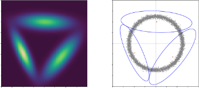
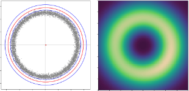

# Negative Gaussian Mixture Components

This was my undergraduate thesis exploring a way to build a generalisable framework to allow for negative components in Gaussian Mixtures. Which served as the preliminary work for the final framework ["Negative Mixture Models via Squaring: Representation and Learning"](https://openreview.net/forum?id=uTAzte88a2) by Lorenzo Loconte et al. as apart of the research group of my supervisor Antonio Vergari.

## Breif Motivation

The details of this framework and final model is detailed in my thesis (which is found under `docs/thesis.pdf`). However, to appreciate the achievements of this project this section will highlight the motivation behind this project.

The basic idea is rather simple. Imagine you have some complex distribution of points to model with a GMM (complex in that you will need a lot of components to model), let's take the example of a donut shape. Using a traditional GMM you will have to place a lot of components along the ridge of the donut to get a nice uniform distribution.

However, as humans it makes sense to simply have a large positive component encapsulating all the points, and then subtracting away all the probability mass in the middle (sort of the same way you actually make a donut in real life). The problem here is that the final mixture has to be a valid PDF, which implies the whole mixture has to integrate to 1 and that there should be no negative values along the PDF. Which makes the task of subtracting away the probability mass in the middle tricky, however, that is what this project has achieved and is outlined in my thesis found under `docs/thesis.pdf`.

The table below demonstrates how a traditional GMM is not able to model the donut with only 3 components on the left, and the right side demonstrates how the Negative-GMM (NGMM) is able to effectively model this complex distribution.

| 3-Comp. GMM                               | 3-Comp. GMM w/ Negative Components              |
| ----------------------------------------- | ----------------------------------------------- |
|  |      |

Thus, it is trivial to see that this framework introduces a lot of flexibility in terms of modeling complex datasets with exponentially fewer components and implicitly fewer parameters to optimize. The framework that I built for this was constructed for a high level of generalisability, to support any exponential parametric distributions and deeply-nested mixtures. Which [Lorenzo Loconte et al.](https://openreview.net/forum?id=uTAzte88a2) accomplished with my experiments being the preliminary step for this generalisation.

## Getting Started

### Dependencies

The project depends on Weights and Biases (WandB) for logging. This package is included in the requirements, however it is required that you login with your own account.

### Setup - PIP 

1. Setup conda environemt with required packages
```
pip install -r requirements.txt
```
2. Login to your WandB account
```
wandb login
```
3. In `experiment_builder.py` update line 87-91 with your WandB project and entity/username.
```
wandb.init(
    project=<project_name>,
    entity=<username/entity>,
    config={**model_config}
)
```

### Setup - Conda Environment 

1. Setup conda environemt with required packages
```
conda env create -f environment.yml
```
2. Login to your WandB account
```
wandb login
```
3. In `experiment_builder.py` update line 82-86 with your WandB project and entity/username.
```
wandb.init(
    project=<project_name>,
    entity=<username/entity>,
    config={**model_config}
)
```

### Executing program

* Run a local experiment using one of the dataset shapes provided under `data/`. See `local_scripts/` to see how to run an experiment with any of these shapes.
```
chmod +x local_script/<experiment_name>.sh && ./local_script/<experiment_name>.sh
```

## Help

If you encounter any issues please feel free to reach out by email patrick@tourniaire.net

## Authors

* Patrick Tourniaire | patrick@tourniaire.net 

## Related Paper

This project served as a preliminary set of experiments and exploration for the paper ["Negative Mixture Models via Squaring: Representation and Learning"](https://openreview.net/forum?id=uTAzte88a2) by Lorenzo Loconte et al.

## Acknowledgments

Inspiration, code snippets, etc.
* [PyKeops - GMM with SGD](https://www.kernel-operations.io/keops/_auto_tutorials/gaussian_mixture/plot_gaussian_mixture.html)
* [Dataset shapes](https://arxiv.org/abs/1811.08357)
* [Batched mahalanobis distance](https://github.com/pytorch/pytorch/blob/main/torch/distributions/multivariate_normal.py)
